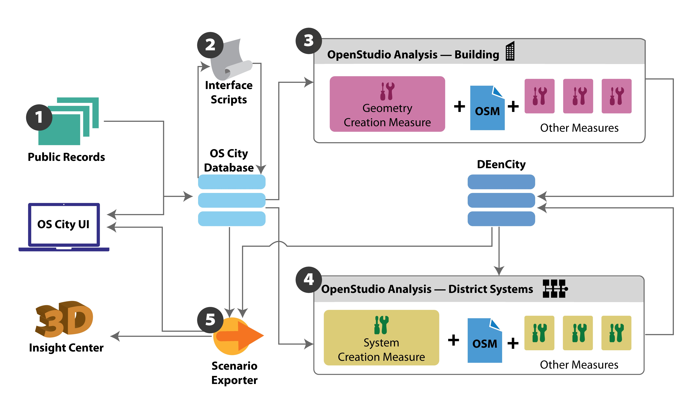

# OpenStudio Urban Measures

This repository contains OpenStudio measures and utilities for urban modeling. An overview of this functionality is shown below:

The OpenStudio Urban Modeling platform is built around the OpenStudio City Database.  The OpenStudio City Database stores information about buildings and analyses and imports/exports JSON formated data through a RESTful API.  Building, taxlot, and region data is transfered in GeoJSON format; supported properties are defined in [JSON Schema](http://json-schema.org/) format for [buildings](./building_properties.json), [taxlots](./taxlot_properties.json), [regions](./taxlot_properties.json), and [district systems](./district_system_properties.json).  Analysis data is transferred in the [OpenStudio Analysis](https://github.com/NREL/OpenStudio-analysis-gem) (OSA) format.  As an intermediate step, [OpenStudio Workflow](https://github.com/NREL/OpenStudio-workflow-gem/blob/develop/spec/schema/osw.json) (OSW) can be used to specify simulation workflow instead of the full Openstudio Analysis.  Simulation results are stored in a [DEnCity](http://dencity.org/) database; high level simulation results can be imported from DEnCity into the OpenStudio City Database.  A typical workflow is detailed below:

1. The first step in the urban modeling process is to import public records for existing buildings into the database.  This is done by uploading GeoJSON files containing building, taxlot, region, and district system information to the RESTful API.  NREL has developed a [system]((https://github.nrel.gov/jabbottw/City_Building_Model) to export data from a Postgres database to GeoJSON for upload.
2. Once initial public record data is imported, one or more scripts can be run to fill in missing data or transform the data in some way.  Example use cases include inferring the number of stories for buildings or assigning space types by sampling from the CBECS data set.
3. An OpenStudio Analysis (OSA), created by PAT 2.0, is uploaded to the city database as a template.  The OSA specifies a set of variables that define the parameter space for the analysis as well as seed model and measures.  A separate API call requests to run the analysis template for a given building, generating a new analysis in the database and queues it to run.  Any building properties which have the same name as arguments or variables in the template analysis overwrite the default values for those arguments or variables in the new analysis.  For example, if the building has property 'heating_method' and the template analysis has a static argument 'heating_method', the building's 'heating_method' value will replace the value for 'heating_method' in the new analysis.  Typically, building analyses will include the Urban Geometry Creation Measure.  This measure pulls GeoJSON data from the city database's API to creates geometry for a given building (including adjacent buildings for heat transfer and surrounding buildings for shading).   This measure also assigns stub space types with names that match CBECS PBA codes for commercial buildings or RECS Structure codes for residential buildings.  Mixed-use buildings may have difference space types per floor, the primary building space type will be assigned at the building level.  Once the geometry is created it is passed through other measures as defined by the OpenStudio Analysis.  Results from simulations are pushed to a [DEncity](https://dencity.org) database.
  1. As a temporary step we will be able to upload OpenStudio Workflow (OSW) as a template rather than a complete OpenStudio Analysis.  Workflows generated from the Workflow template for a given building will be assigned a unique id that can be used to look up results in DEnCity.
4.  After the analysis is complete, results from the DEncity database are imported into the database and a GeoJSON file with embedded results is exported.  A scenario JSON defines the variable values for each building; pairing each building with a particular datapoint.  The variables and allowable values are defined by the OpenStudio Analysis JSON.  The variable values associated with each building in the scenario are used to look up results in the DEncity database.
5. If the scenario includes district systems, a district level template analysis can be uploaded and run.  This analysis writes district system OSM files and simulates them, pushing the results back to DEncity.  The scenario exporter then includes district simulation results in the results GeoJSON.
6. Once a results GeoJSON is written for a particular scenario, the results can be visualized in the desktop results GUI or the NREL Insight Center.  

# OpenStudio City Database

## API

* Import GeoJSON which can contains buildings, taxlots, regions, or district systems.  If existing records already exist (according to source id) then update them.
* Get GeoJSON for region, taxlot, or particular building or district system.  Building, taxlot, region, or district system properties should be inserted into the GeoJSON.For particular building include option to include surrounding buildings.  
* Upload OpenStudio Analysis JSON as a template analysis.
  *  As a temporary step we will also want to be able to upload OpenStudio Workflow (OSW) JSON as a template
* Run OpenStudio Analysis for particular building or district system (takes template analysis id and building/system id).
  *  As a temporary step we also want to be able to run a template workflow for a given building or system.
* Import data from DEnCity for analysis.
* Export scenario (takes scenario JSON, which is pretty much a list of datapoints, as input).

# Reference

For reference the RECS Structure codes are:

* Single-Family
* Multifamily (2 to 4 units)
* Multifamily (5 or more units)
* Mobile Home

The CBECS PBA codes are:

* Vacant
* Office
* Laboratory
* Nonrefrigerated warehouse
* Food sales
* Public order and safety
* Outpatient health care
* Refrigerated warehouse
* Religious worship
* Public assembly
* Education
* Food service
* Inpatient health care
* Nursing
* Lodging
* Strip shopping mall
* Enclosed mall
* Retail other than mall
* Service
* Other

# Installation

## OpenStudio City Database

## OpenStudio Standards

1. Check out https://github.com/NREL/openstudio-standards
2. `cd \openstudio-standards\openstudio-standards`
3. `bundle install`
4. `rake build`
5. `gem install --user-install pkg/openstudio-standards-0.1.0.gem`
6. Set environment variable GEM_PATH to the user gem directory, e.g. C:\Users\dmacumbe\.gem\ruby\2.0.0
