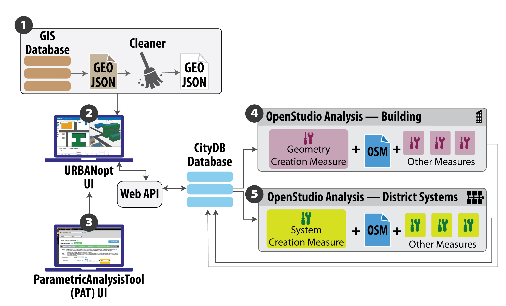

# OpenStudio Urban Modeling

This repository contains functionality for urban modeling with OpenStudio. An overview of this functionality is shown below:

The OpenStudio Urban Modeling platform is built around the OpenStudio City Database.  The OpenStudio City Database stores information about the urban model, JSON formated data is imported and exported through a RESTful API.  Building, taxlot, and region data is transfered in GeoJSON format; supported properties are defined in [JSON Schema](http://json-schema.org/) format for [buildings](./schema/building_properties.json), [taxlots](./schema/taxlot_properties.json), [regions](./schema/taxlot_properties.json), and [district systems](./schema/district_system_properties.json).  [OpenStudio Workflow](https://github.com/NREL/OpenStudio-workflow-gem/blob/develop/spec/schema/osw.json) (OSW) format is used to specify simulation workflows.  A simulation datapoint is created by pairing a building (or district system) with a particular workflow.  Simulation results for each datapoint are stored in the OpenStudio City Database.  A typical workflow is detailed below:

1. The first step in the urban modeling process is to assemble GeoJSON files containing building, taxlot, region, and district system information for upload to the RESTful API. These files should have properties as described by the JSON schema files. 
    * Data for existing building can be exported from GIS databases or converted from other formats such as CityGML. Example GeoJSON files can be found in the [data](./data/) directory.
    * NREL has developed a [system]((https://github.nrel.gov/jabbottw/City_Building_Model) to export data from a Postgres database to GeoJSON for upload.
    * Data files can also be genarated using a GeoJSON editor such as [geojson.io](http://geojson.io/)
    * Once the data is in GeoJSON format, one or more scripts can be run to fill in missing data or transform the data in some way.  Example use cases include inferring the number of stories for buildings or assigning space types by sampling from the CBECS data set.  Example scripts can be found in the [data](./data/) directory.

1. Once complete GeoJSON files have been created, they can be uploaded to the City Database.  Each GeoJSON file is uploaded to a particular user defined project. 

1. Simulation workflows are specified in OpenStudio Workflow (OSW) format and uploaded to a project in the City Database.  Each workflow specifies a series of OpenStudio Measures to apply in order to simulate a given building.  Several Option Sets can be defined for each workflow, each option set prescribes values to each measure argument. A datapoint is created for each building/option set pair (that is a datapoint is the result of simulating a particular building with a particular workflow).  When a datapoint is simulated, building properties are applied to any OpenStudio Measure arguments with the same name.  For example, if a measure in the workflow takes an argument named `space_type` and the building's properties specify `space_type: "Office"` then the value `"Office"` will be passed to the measure argument named `space_type`.  Example workflows can be found in the [workflows](./workflows/) directory.

    * Typically, building analyses will include the Urban Geometry Creation Measure.  This measure pulls GeoJSON data from the city database's API to creates geometry for a given building (including adjacent buildings for heat transfer and surrounding buildings for shading).   
    * A reporting measure will also push results back to the database.  High level simulation results can be added to the datapoint directly.  Larger results (such as timeseries data) can be attached to the datapoint as related files.
    * In the future, complete OpenStudio Analyses (OSA) files will be uploaded to the City Database.

1. Multiple scenarios are developed for each project.  A scenario pairs each building with a specific workflow option, resulting a in list of datapoints.

1. Once all input data has been defined in the City Database, the project can be run using the [run_project](./run_project.rb) script.  This script will create and simulate datapoints for each building/workflow option combination in each scenario.

1.  After the analysis is complete, a GeoJSON file with embedded results can exported for each scenario.  This file includes results of running each building in the project with their paired workflow.  This resulting GeoJSON file can be viewed from the scenarios page.
    * In the future, more results will be available for each scenario.

# General Installation

1. Install git.  On Windows we use [Git for Windows](https://git-scm.com/download/win).
1. Install Ruby.  On Windows we use [RubyInstaller](http://rubyinstaller.org/downloads/).  Make sure Ruby is in your path so you can run Ruby commands.  
1. On Windows, you will need to install Ruby DevKit.  Go on [this page](http://rubyinstaller.org/downloads/) and search for “Development Kit” then choose the right version based on your version of Ruby.  After you install DevKit follow the [instructions here](https://github.com/oneclick/rubyinstaller/wiki/Development-Kit] to install it.

# OpenStudio City Database

If you want to develop or run the OpenStudio City Database locally, follow these [installation instructions](./website/README.md).  Otherwise you will need access to an instance of the URBANopt website.

# Running an Analysis

1. Upload  buildings and workflows to a project in an OpenStudio City Database.
1. Install OpenStudio. 
1. Update the `config.rb` file with information specific to your computer.  If you do not have a `config.rb`, copy the file `config.rb.in` to `config.rb` and edit.
1. Open a command prompt (must have git commands available) in the root directory:
    * Run the command `rake` to initialize your simulation environment.
    * Run the command `bundle install` to install dependencies.
    * Run the command `bundle exec ruby test_run.rb` to test running workflows without access to a City Database.
    * Run the command `bundle exec ruby find_test_failures.rb` to find test failures.
    * Run the command `bundle exec ruby run_datapoints.rb` to run specific datapoints for a specific project (configured in `config.rb`).
    * Run the command `bundle exec ruby run_everything.rb` to run all datapoints in a specific project (configured in `config.rb`).
    * Run the command `bundle exec ruby run_watcher.rb` to start a process that watches for new datapoints and runs them as they are created.
    * Run the command `bundle exec ruby find_run_failures.rb` to find simulation failures.
1. Simulation results will be created in the `run` directory as well as pushed results to the City Database.

