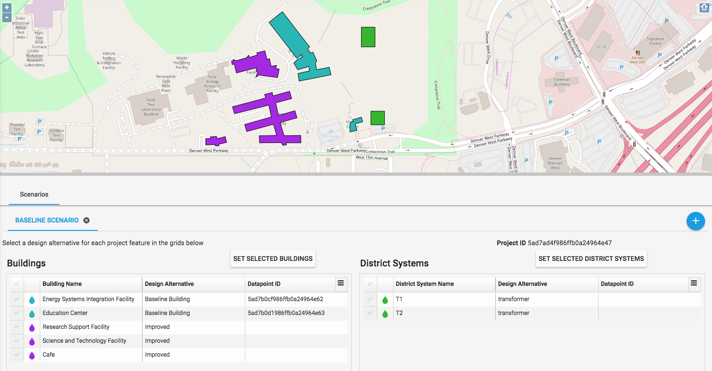

# URBANopt Workflow 

The following tutorial describes the process of performing urban modeling with OpenStudio and the URBANopt website.  

- [Getting Started](#getting-started)
- [Setup the Project on URBANopt website](#setup)
- [Run the Analysis](#run)
- [Visualize the Results](#results)
- [Create Custom Workflows](#workflows)

## Getting Started
 For this workflow, you will need access to an instance of the URBANopt website.  The site could be running locally or be deployed on a server or cloud hosting platform.
 Although the URBANopt website holds all of the details of your urban modeling project, the actual simulation is run locally on your machine.  Follow the steps below to configure your local machine for running simulations:
 
1.  Install git.  On Windows we use [Git for Windows](https://git-scm.com/download/win).
1.  Install Ruby. On Mac we install ruby via rbenv.  On Windows we use [RubyInstaller](http://rubyinstaller.org/downloads/).  Make sure Ruby is in your path so you can run Ruby commands.  Install the version of ruby supported by OpenStudio; currently v2.2.4. [Check the OpenStudio Compatibility Matrix](https://github.com/NREL/OpenStudio/wiki/OpenStudio-Version-Compatibility-Matrix)  
1.  On Windows, you will need to install Ruby DevKit.  Go on [this page](http://rubyinstaller.org/downloads/) and search for “Development Kit” then choose the right version based on your version of Ruby.  After you install DevKit follow the [instructions here](https://github.com/oneclick/rubyinstaller/wiki/Development-Kit] to install it.
1.  Install OpenStudio.  We currently recommend v2.4.1.
1.  Checkout a copy of the [openstudio-urban-measures](https://github.com/NREL/openstudio-urban-measures) repository.  This repo will be used to run the local analyses.

##Setup the project on URBANopt website

### Initial Setup
1. First login to the URBANopt website.  Once logged in, you will be redirected to the main Projects page.
1. Select an existing project or click on the *ADD NEW PROJECT* button

1. Once you have selected a project, you will see navigation icons in the top navbar. The pages are, in order: *Site*, *Buildings*, *District Systems*, *Scenarios*, *Run*, and *Results*.

1. The *Site* tab is used to enter project-specific information and upload project files.  Select the *Location and Simulation Settings* tab below the map to expose settings related to the overall project, such as climate zone, elevation, simulation timestep, as well as project files such was tariffs and weather data.

### Add Features
1.  There are different feature types supported by URBANopt: Regions, Taxlots, Buildings, and District Systems are the main ones. The *Site* page is used to enter Region and Taxlot features, the *Buildings* page for buildings, and the *District Systems* page for district systems.  The features can be drawn on the map by selecting *Draw -> Rectangle* or *Draw -> Polygon* from the left navigation menu.  Once drawn, the feature will appear in the table below the map, where its properties can be entered.  

Alternatively, if you have features defined in GeoJSON format&mdash;generated from either another URBANopt project or an online editor such as [geojson.io](http://geojson.io)&mdash;, you can import it into your project from any page by selecting *File -> Import GeoJSON* from the left navigation menu.  Example GeoJSON files can be found in the *data* directory of the openstudio-urban-measures repo.  Project GeoJSON can also be exported by selecting *File -> Export* from the left navigation menu.

For easier feature drawing or data entry, the map area can be resized by dragging the gray line directly below the map. Additionally, features can be selected on the map or in the properties table.  

### District System Connections

TODO: district systems connected to buildings (draw connectors)

#### Special Case: Transformers
1. Transformers are a type of district system that can be modeled in URBANopt.  They are entered in the *District Systems* page, and transformer-specific fields such as rating, voltage, phase, and type should be filled out in the *District Properties* table below the map. Rather than using the connectors functionality to connect buildings to transformers, each building can be assigned a transformer on the *Building Properties* table below the map on the *Buildings* page. A custom power factor can be added to the table for apparent power calculations. If blank, a default of 0.9 is used.  Once transformers are assigned, a list of all buildings assigned to a particular transformer can be accessed on the *Transformers* tab of the *District Systems* page. 

### Edit and Visualize Features
 - Once you have added features to URBANopt, you can use the left navigation menu on the *Site*, *Buildings*, or *District Systems* pages to edit the features by using the *Resize*, *Move*, or *Rotate* actions.  If the edit function selected modifies the overall dimensions of the feature, its floor area will be updated in the Properties table below the map. If the feature is moved, its coordinates will be updated.
 

- The *Zoom to Features* action can be used to center the map closely around your project's area.

- The *Map Settings* action will open a dialog that can be used to modify the feature transparency level, background image transparency level (if one has been uploaded for the project), and to toggle between the 2D map and the 3D map.  

- The 3D map can be useful in visualizing building heights.  The 3D map can be tilted by the following keyboard/mouse combination: *CTRL + Mouse Click + Mouse Drag* or *Middle Click + Mouse Drag*

- There is a *Map Render Modes* tab on both the *Buildings* and *District Systems* pages. By clicking the *Render by Building Type* button, buildings will be colored according to their respective building type.

- The default rendering colors for Site, Building, and District System features can be configured per project. Click on the project's *Edit* button on the *Projects* page to open a dialog that contains color pickers for each feature type.  Make sure to scroll down to the bottom of the dialog window and click the *Save* button.

### Create Design Alternatives
Building and District System features can be simulated in OpenStudio.  Before this happens, Design alternatives must be created.  Design alternatives are feature type specific and describe all OpenStudio Measures and their respective argument values in OpenStudio Workflow (osw) format.  Design alternatives can be applied to a given feature or set of features.   Multiple design alternatives are created from a single OpenStudio Workflow file by skipping measures and/or editing measure argument values. Follow the steps below to create a Building design alternative.  District System alternatives are created in a similar fashion on the *District System* page.

1.  On the *Buildings* page, select the *Building Design Alternatives* tab below the map.  If you have not yet selected a workflow, you will be prompted to choose between using the default URBANopt workflow and uploading a custom workflow.

For information on how to create a custom workflow, see the [Custom Workflows](#workflows) section below.  Note that if your project contains transformers, you should use the district_system_transformers.osw workflow (or one based closely on it), which  can be found in the *workflows* directory of the *openstudio-urban-measures* repo.

1.  Once a workflow has been created, click on the *New Design Alternative* button in the tab and name your design alternative.

Click on the *Add* button. This will load the list of measures in the workflow. 

1. You can now edit the measure arguments for this design alternative.  You can change measure argument values and choose to skip or unskip whole measures.  the *SET COLOR* functionality allows you to select a color for a particular design alternative, which will be used to render the maps on the *Scenarios* page.

Click the  button to add design alternatives and the  button to modify the underlying workflow for all design alternatives.  Note that you may lose some of your design alternative configurations if you switch workflows.  Choose the *EDIT CURRENT WORKFLOW* option to retain as much of the existing design alternatives as possible.  Choose the *UPLOAD A NEW WORKFLOW* option to delete all existing design alternatives and start over with the new workflow.

### Configure Scenarios
Scenarios can be configured once design alternatives have been created for the project.  

1. Navigate to the Scenarios page and click on the *NEW SCENARIO* button.  Name your scenario and click *ADD*.

1. Below the map you will see a table for Buildings and a table for District Systems.  This is where the features are associated with a specific design alternative, and the actual datapoints that will be simulated are created.  Design alternatives can be set in the tables on a per-feature basis, or can be bulk-assigned by clicking on the checkmarks on the left of the table and clicking the *SET SELECTED BUILDINGS* or *SET SELECTED DISTRICT SYSTEMS* buttons, depending on the feature type being configured.  Features can  also be selected directly from the map by clicking on them (and holding down the *Shift* key to select multiple features at the same time).  As features are selected from the map, the associated rows in the table will be highlighted.  The map will then render features colored based on the selected design alternative for that scenario, for quick troubleshooting.  

Multiple scenarios can be created, each selecting a different design alternative for a specific building or district system.  Results can then be compared at the scenario level after the simulations are run.

## Run the Analysis
Once the project has been completely configured in the URBANopt website, the focus shifts to your local checkout of the *openstudio-urban-measures* repo, where the analysis will actually be run. 

The figure below shows the directory structure of the repo.
 

The *measures*, *seed*, and *weather* directories contain data that may be used in URBANopt project (depending on the paths configured in the config.rb file).  The *measures* folder, specifically, contains copies of measures used in typical URBANopt workflows.  The *workflows* directory contains example workflows that could be used on URBANopt.

The *config.rb* file is where the local run is configured with an URBANopt website  instance.  To configure your local analysis: First copy the file *config.rb.in* located in the root directory of the repo to a new file called *config.rb*.  This file contains settings related to your URBANopt website instance (URL, USER_NAME, USER_PWD, PROJECT_ID, DATAPOINT_ID), path to your local OpenStudio executable, paths to local OpenStudio measures directories (including the measures directory located within the openstudio-urban-measures repo), and paths to OpenStudio file locations.

The *run* directory is where your analysis results will be generated locally before being pushed back to the URBANopt website.

The *data* directory contains example GeoJSON files

There are also various scripts for testing, updating workflows, and running analyses in the root of the repo.  Most importantly:

- Use the `run_datapoints.rb` script to run a subset of datapoints from a project
- Use the `run_project.rb` script to run an entire project

To Run an analysis:

1. **Setup**.  Edit the `config.rb` file.

	- Update the Logger level (if desired).  The *DEBUG* level is helpful when running the simulation for the first time. 
	- Set the *URL* constant wih the URBANopt website URL 
	- Set the *OPENSTUDIO_EXE* constant with the path to your local OpenStudio executable
	- Set the *OPENSTUDIO_MEASURES* constant with the paths to all local OpenStudio measures directories you want to use. Note that the first item in the array points to the measures directory within the *openstudio-urban-measures repo*, which you most likely will need.  The paths will be searched in the order listed in the paths array.
	- Set the *OPENSTUDIO_FILES* constant with the paths to all locations that may contain files required by the simulation (such as weather files and adapters).
	- Set the *USER_NAME* and *USER_PWD* with your URBANopt website login credentials
	- Set the *MAX_DATAPOINTS* constant.  Select a small number for testing purposes (the simulation will stop after that number of datapoints).  Set to `Float::INFINITY` when you are done testing to run all datapoints in the project.
	- Set the *NUM_PARALLEL* constant.  This represents the number of datapoints you want to run in parallel, and depends on the number of available processors on your local machine.
	-  Set the *PROJECT_ID* constant to your URBANopt projectID.  You can get your project's ID from the browser URL bar or from the *Run* page.
	
	-  Set the *DATAPOINT_IDS* constant if you want to run a specific subset of datapoints.  If you want to run them all, set `DATAPOINT_IDS = []`.  Datapoint IDs can be retrieved from the tables within each scenario on the *Scenarios* page or from the *Run* page (See above).  

	##### Note about IDs
	Project, Features, Design Alternatives, Scenarios, and Datapoints all have an ID that consists of 24 alphanumeric characters (i.e., 5ad7ad4f986ffb0a24964e47).  The IDs are used to associate buildings with a project, a design alternatives with a building(s) and a scenario(s), and, most importantly, to identify datapoints.  A datapoint represents the association of a particular building, a particular design alternative, and a scenario or set of scenarios in which the design alternative is applied to the building.  It is those fully-specified datapoints that are run in the analysis, stored in the local *Run* folder, and displayed on the *Run* page.  
	
	The best place to view the relationship between a datapoint and its associated building/district system, design alternative, and scenario(s) is in the Datapoints table on the *Run* page (see above). 

1.  **Run**. Open a terminal window and navigate to the root of the *openstudio-urban-measures* repo.  
	- To run the whole project, type this command: `bundle exec ruby run_project.rb`
	- To run a subset of specific datapoints, type this command: `bundle exec ruby run_datapoints.rb`
Depending on your logging level, you will see output data printed to the screen.  

1.  **View Local Results**.  Local result files can be found in a directory labeled with the project name in the *run* directory.  The figure below shows an example of a project folder.  It contains directories for each datapoints that were run as well as a project_files directory.  The project_files directory contains a local copy of the project files originally uploaded to URBANopt.  The datapoint directories contain details about the datapoint simulation:  run log, input model and workflow, and results.  The csv data from the analysis can be found in the *reports* directory.

	

1.  **View Results on URBANopt**.  Analysis results are automatically pushed back to the URBANopt website.  Visit the *Run* page for an overview of your project simulation, including datapoint status. Click on the  button to view raw results as well as to download individual datapoint result files.  For project-level results, see the [Results](#results) section below.

	

#### Troubleshoot Run Errors
1. Check datapoint status on *Run* tab.  Failed datapoints will be clearly labeled. To troubleshoot the error, locate the matching datapoint directory locally and open the *run.log* file located in the *run* directory inside.  Search for the keyword "ERROR]" to quickly locate the error.  If the error points to an EnergyPlus error, view the *eplusout.err* file inside the same directory.
1. If there is an error in the terminal window where you ran the code, check the code around the line number displayed in the error message.
1. If nothing runs, ensure that the projectID and/or datapointIDs are set correctly.

#### Notes about Analysis Run

- run_datapoints.rb will run the datapoints specified in the *config.rb* regardless of status (whether they have been run before or not)
- run_projects.rb will only run the datapoints that do not have Status set to *Completed*.  Datapoint status can be seen in the table on the *Run* page.  You can reset a datapoint's status to rerun it by pressing the  button.  You can also reset all datapoints by clicking the *RESET STATUS ON ALL DATAPOINTS* button at the bottom of the *Run* page.

## Visualize the Results

Project results can be viewed on the *Results* tab.  

- The *Map* tab allows you to visualize a result property (EUI, LPD, etc.) on the map, across all buildings in a given scenario.  The result property is selected from a dropdown.

- The *End Use Comparison* tab compares Monthly Fuel Use, Monthly Net Energy, and Annual End Uses breakdown across all scenarios (or a selected subset of scenarios) in the project

- The *Transformers* tab displays transformer load for all transformers in the project.  Plots of the max peak and worst RPF days are also available, as is a table listing various transformer properties, number of hours over rating, and a list of associated buildings.

## Custom Workflows
 TODO: how to create workflows and edit existing workflows for use on URBANopt
